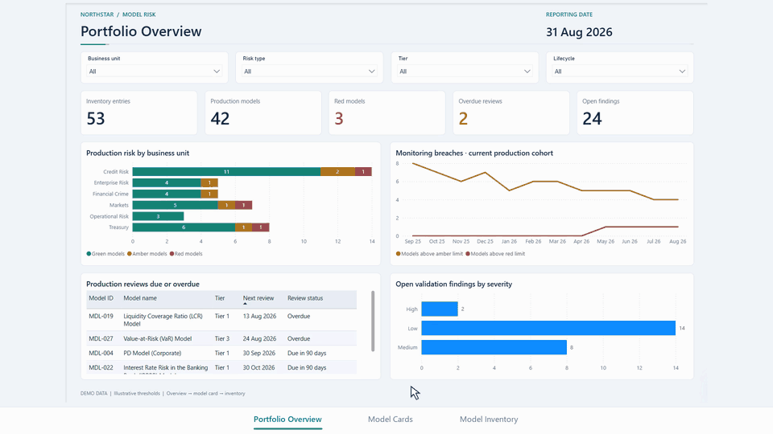

# Model Risk Dashboard

A Microsoft Power BI demonstration of model risk oversight across a commercial-bank portfolio. Explore portfolio risk, inspect individual model cards, and browse the underlying model inventory.

**Built using publicly available sources and synthetic dummy data. No confidential, proprietary, customer, or internal bank information was used.** Model names and categories are based on the public [Commercial Bank Risk Model Inventory](https://github.com/at621/snippets/blob/main/model_inventory.md). Governance records, owners, dates, monitoring values, validation outcomes and findings are fictional. “Northstar” is demonstration branding.

## Preview

## Open the dashboard

1. Download or clone this repository.
2. Open [dashboard/ModelRisk.pbix](dashboard/ModelRisk.pbix) in **Microsoft Power BI Desktop for Windows**.
3. Use the three report tabs and their filters to explore the demo.

The PBIX includes the dummy data, report and model. No separate workbook or external data connection is needed to open the local demo.

| Page | What you can do |
| --- | --- |
| **Portfolio Overview** | Filter the portfolio; review risk distribution, monitoring breaches, upcoming or overdue reviews, and validation findings by severity. |
| **Model Cards** | Choose a model and inspect its status, ownership, validation outcome, review date, scope, limitations, timeline and findings. |
| **Model Inventory** | Browse and filter model records. Select a row to filter its findings, or right-click a model to drill through to its card. |

## Demonstration data

The reporting snapshot is **31 August 2026**. It contains **53 inventory entries**, including **42 production models**: **33 green, 6 amber and 3 red**. There are **24 open findings**: **2 high, 8 medium and 14 low**.

The inventory spans credit risk, treasury, markets, operational risk, financial crime and enterprise risk. See the [public model list](https://github.com/at621/snippets/blob/main/model_inventory.md) for the source catalogue.

All status rules and thresholds are illustrative. Monitoring history covers the current production cohort; it does not reconstruct historical portfolio membership. Different models have different technical metrics, so model cards emphasize governance and validation information. This is a demonstration, not an assessment of an actual institution.

## Repository contents

| File | Contents |
| --- | --- |
| `dashboard/ModelRisk.pbix` | Ready-to-open dashboard with embedded dummy data |
| [dashboard/ModelRisk_RawData.txt](dashboard/ModelRisk_RawData.txt) | Raw dummy data for all seven tables, in JSON-formatted text |
| `docs/media/walkthrough.gif` | Animated dashboard preview |
| `README.md` | Overview and launch instructions |
| `LICENSE` | MIT license |

## License

[MIT License](LICENSE), copyright © 2026 at621. Linked third-party sources retain their respective terms.
